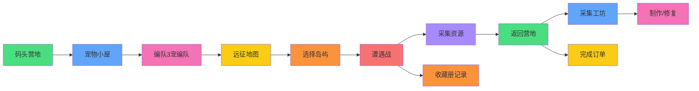

## 1. 产品概述

冒险岛宠物远征管理游戏是一款以冒险岛题材的桌面休闲养成类Web游戏。玩家经营一支由奇幻宠物小队，在神秘群岛间展开探索冒险。游戏融合宠物养成、资源管理、策略远征与收藏等核心玩法，通过精心设计的6大核心界面，提供沉浸式的冒险体验。

## 2. 核心功能

### 2.1 用户角色

| 角色 | 注册方式 | 核心权限 |
|------|----------|----------|
| 冒险者 | 直接进入游戏 | 体验全部游戏功能，管理宠物小队，探索群岛|

### 2.2 功能模块

1. **码头营地**：营地设施概览、岛民订单板、资源仓库、远征队出发/归来管理

2. **宠物小屋**：宠物蛋孵化区、宠物属性心情面板、喂食区、休息区、宠物选择编队

3. **远征地图**：群岛航线地图、航线难度选择、目标岛屿详情、远征队派遣

4. **采集工坊**：资源采集点、工坊制作台、装备修复、便携道具制作

5. **遭遇战**：自动战斗系统、怪物遭遇、宠物协同技能释放、战利品结算

6. **收藏册**：宠物羁绊图鉴、岛屿探索完成度、远征日志记录、稀有发现图鉴

### 2.3 页面详情

| 页面名称 | 模块名称 | 功能描述 |
|----------|----------|----------|
| 码头营地 | 设施升级面板 | 升级码头等级、仓库容量、工坊等级、孵化巢等级 |
| 码头营地 | 岛民订单板 | 查看订单需求、提交材料、领取奖励、订单刷新 |
| 码头营地 | 资源仓库 | 展示矿石/草药/贝壳/金币/经验 |
| 宠物小屋 | 孵化巢 | 孵化宠物蛋、查看孵化进度、加速孵化 |
| 宠物小屋 | 宠物属性面板 | 查看等级、HP、攻击、防御、速度、心情值 |
| 宠物小屋 | 喂食休息区 | 投喂食物恢复心情、安排休息恢复体力 |
| 宠物小屋 | 编队面板 | 选择3只宠物组成远征队 |
| 远征地图 | 群岛地图 | 可视化群岛、航线连接、已解锁/未解锁状态 |
| 远征地图 | 岛屿详情 | 岛屿等级、特产资源、怪物类型、掉落物品 |
| 远征地图 | 派遣面板 | 选择航线、确认远征队、消耗补给品选择 |
| 采集工坊 | 资源采集 | 点击采集矿石/草药/贝壳节点、随机产出 |
| 采集工坊 | 道具制作 | 消耗材料制作药水、卷轴、工具 |
| 采集工坊 | 装备修复 | 修复受损武器、护甲，提升耐久度 |
| 遭遇战 | 战斗场景 | 自动回合制战斗、HP条动画、攻击特效 |
| 遭遇战 | 协同技能 | 积攒能量条、释放组合技能释放、技能冷却 |
| 遭遇战 | 战利品结算 | 战斗胜利奖励、稀有掉落展示 |
| 收藏册 | 宠物羁绊 | 宠物羁绊组合、羁绊加成效果 |
| 收藏册 | 岛屿完成度 | 各岛屿探索进度、收集百分比 |
| 收藏册 | 远征日志 | 历史远征记录、成就解锁 |

## 3. 核心流程

玩家进入游戏后，首先在码头营地查看资源状态 → 前往宠物小屋孵化和培养宠物 → 在小屋喂食并编队 → 打开远征地图选择航线和岛屿 → 派遣远征队探险 → 途中遭遇战自动战斗并释放协同技能 → 采集资源后返回营地 → 在采集工坊制作道具修复装备 → 完成岛民订单 → 收集稀有发现记录收藏。

## 4. 用户界面设计

### 4.1 设计风格

- 主色调：深海蓝(#1e3a5f) 搭配黄金(#fbbf24) 海洋绿(#10b981)

- 辅助色：珊瑚粉(#fb7185) 薰衣草紫(#a78bfa) 琥珀橙(#f59e0b)

- 按钮风格：圆角矩形(圆角xl)、渐变填充、悬停上浮阴影、按压下沉效果

- 字体：标题使用 ZCOOL KuaiLe(中文圆体活泼风)，正文使用 Ma Shan Zheng(手写楷体)

- 布局风格：卡片式布局、像素边框装饰、手绘风图标使用 emoji 配合 lucide图标

### 4.2 页面设计概览

| 页面名称 | 模块名称 | UI元素 |
|----------|----------|--------|
| 码头营地 | 整体风格 | 海洋主题、木质纹理背景、船坞装饰、海浪动画

| 宠物小屋 | 整体风格 | 温馨木屋风、暖色调、宠物笼、窗户阳光照射

| 远征地图 | 整体风格 | 羊皮卷地图风格、 parchment纹理、航线虚线动画

| 采集工坊 | 整体风格 | 工匠工坊、金属质感、炉火动画

| 遭遇战 | 整体风格 | 战斗竞技场、血条、技能按钮光晕

| 收藏册 | 整体风格 | 古籍书页、翻页动画、发光边框

### 4.3 响应式

桌面端优先设计，适配主流分辨率 1920x1080，兼容平板横屏，移动端自适应布局调整为垂直堆叠

### 4.4 动画与特效

- 页面切换：淡入淡出+滑动过渡

- 宠物 idle：呼吸浮动动画

- 战斗：攻击晃动、伤害数字飘出、技能闪光

- 采集：资源节点闪烁、收集物飞入背包

- 按钮：悬停放大、点击涟漪

- 地图：航线流动光点

